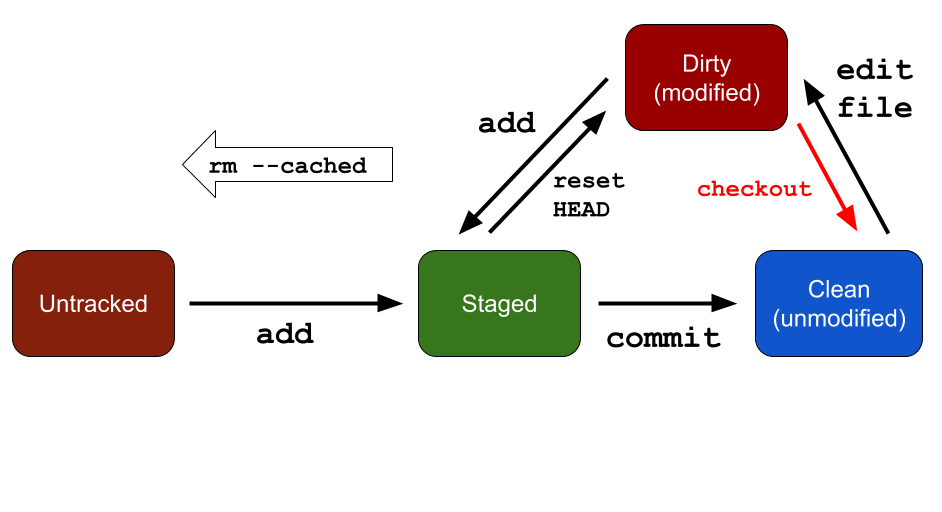

## git 筆記  for 曾老師上課
### work for   
* 工程師  
* DevOps  
* 設計師  
* 研究生...

### 名詞

**Reposity 容器  **  
以資料夾為單位  
.git file 來判斷裡面上傳的狀況  

**Commit 提交**  
一個commit 可以代表一個版本

**Tag 標籤 **  
代表對外發布的版本號碼  
用來指向特定的commit  

**.gitignore **  
在容器內使用的特殊檔案，用來虛數不要加進git 的檔案或者資料夾  
哪些東西不應該被加入git?  
> 有一個網站可以讓你搜尋
[gitignore.io](https://www.gitignore.io/)  


**Remote 遠端容器**
* 被擺放的伺服器被稱為git server  
* 使用push, pull 和遠端容器進行專案同步   

****
### 三個狀態  
* dirty  
* staged
* clean


### 遠端協作
**remote add : 和遠端容器建立連接**  
```
git remote add origin http:github....  
git push origin master  
git pull origin master  
git clone ...
```
### BitBucket   
* 可擺放git專案
* 初期新創的好選擇
* 七人以上協作同一個專案才要收費

### git checkout 切換分支時  
會在最尾端  


### 小技巧
* git diff 觀看這一個版本跟上一個版本的差異  

### merge遇到conflict  
```
git checkout master
git merge branch
>>>>>>>>>>>conflict
```
**解決方法**  
* 列出兩方衝突的程式碼  
等號上方是master 的code  
等號下方是branchName 的code
```
<<<<<<<<<< HEAD
cc
master branch
============
ccsdf
sadfsd
sadfsadf
sadfsadfsdf
asf
>>>>>>>>>>>>>>>>
```
* 修改方式就是砍掉你不要的，然後刪掉箭頭跟等號
```
cc
ccsdf
sadfsd
sadfsadf
sadfsadfsdf
asf
```
* merge 後的 branch 會被留著，砍掉的方式是git branch -D branchName   

### Best Practice
* commit盡量精簡，一個commit，一個功能  
* 善用branch  

### 版本回朔
```
git rm xxx.file  砍掉檔案
git rm --cached xxx.file 讓檔案變成unstage
git reset --hard HEAD  回朔到HEAD時候的狀態
```
### git stash
* 因為merge的時候要clean的狀態才可以merge  
* 用來暫存 目前 dirty/staged狀態的改動
* 多人協作時常用來搭配pull使用，避免雙方沒有都在clean的狀態下merge，產生衝突
* git stash apply 把暫存放回去  

```
git stash
git pull origin master
git stash apply
git commit ...
git push origin master
```
### git merge --squash feature1
* 把整個branch 壓縮 放在master 的最末(HEAD)，變成一個staged的狀態  
* 代表還要在commit 一次  

### git rebase  
將整個branch，搬到master的最末(HEAD)之後。

### git pull --rebase origin master  
pull 指令的變形，相當於fetch + rebase

### 推薦GUI
