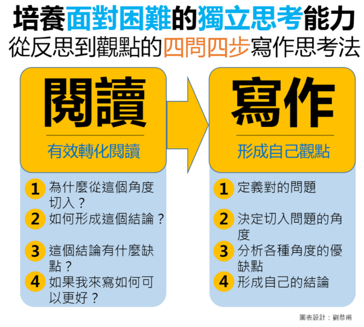

## 訓練「獨立思考」最好的方法是寫作，而不只是閱讀
  
> 閱讀時 : 有效轉化閱讀。  

1. 為什麼要從這個角度切入 - why this angle
2. 如何形成這個結論  - how result
3. 這個結論有什麼缺點？ - weakpoint
4. 如果我來寫如何可以更好 - how better  
> 寫作時 : 形成自己觀點。

1. 定義對的問題 - delimit right question
2. 決定切入問題的角度 - angle to question
3. 分析角度的優缺點 - analysis
4. 形成自己的結論 - own result

文章網址http://www.managertoday.com.tw/columns/view/52205
